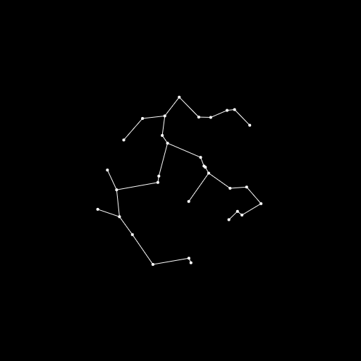

# emst
> generates a euclidean minimum spanning tree from a given graph

This module exposes the `span` function, which uses [Prim's algorithm] to generate a [minimum spanning tree] based on [Euclidean distance] from a given graph.

## usage

### `span(graph) -> tree`
Converts a `graph` with the fields `nodes` (a list of `[ x, y ]` pairs) and `edges` (a list of undirected node index pairs) to a minimum spanning tree.

[Prim's algorithm]:      https://en.wikipedia.org/wiki/Prim%27s_algorithm
[Minimum spanning tree]: https://en.wikipedia.org/wiki/Minimum_spanning_tree
[Euclidean distance]:    https://en.wikipedia.org/wiki/Euclidean_distance
